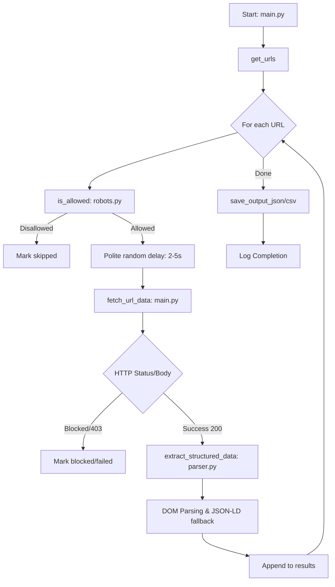

# scraper_project

A polite, production-ready Python web scraper that fetches structured data from several URLs, respects `robots.txt`, handles anti-bot blocking, retries on transient failures, and outputs results to both JSON and CSV.

---

## Table of Contents

- [Project Structure](#project-structure)
- [Architecture & Lifecycle](#architecture--lifecycle)
- [Features](#features)
- [Installation](#installation)
- [Usage](#usage)
- [Ethical Considerations](#ethical-considerations)
- [Answers to Evaluation Questions](#answers-to-evaluation-questions)
- [Extracted Fields](#extracted-fields)
- [Result Statuses](#result-statuses)
- [Logging](#logging)
- [Known Issues & Limitations](#known-issues--limitations)

---

## Project Structure

```text
Url_scraper/
├── main.py                  # Entry point — orchestrates the full pipeline
├── scraper.log              # Auto-generated log file
├── requirements.txt         # Project dependencies
├── output/
│   ├── results.json         # Structured scrape results (JSON)
│   └── results.csv          # Flat scrape results (CSV)
└── utils/
    ├── __init__.py          # Package marker
    ├── logger.py            # Shared logging setup (Hinglish comments)
    ├── parser.py            # HTML parsing, block detection, data extraction
    └── robots.py            # robots.txt fetching and caching
```

---

## Architecture & Lifecycle

The scraper follows a production-oriented pipeline:



1. **URL Discovery**: URLs are resolved from CLI arguments, interactive user input, or a default list.
2. **Compliance Check**: Before fetching, it checks `robots.txt` for the domain.
3. **Polite Pacing**: A random delay (2-5s) is applied between requests.
4. **Resilient Fetching**: Uses exponential backoff retries for transient HTTP errors (429, 500+).
5. **Block Detection**: Detects CAPTCHAs and access denial via status codes and keyword signals.
6. **Layered Extraction**: Pulls data from visible DOM elements first, then falls back to JSON-LD metadata.

---

## Features

- **Multi-URL support** — CLI args, interactive prompt, or default list.
- **robots.txt compliance** — Automatic checks and per-domain parser caching.
- **Polite random delay** — Mimics human patterns to avoid rate-limiting.
- **Exponential backoff retry** — Handles transient failures gracefully.
- **Anti-bot / block detection** — Keyword-based and status-based detection.
- **Structured data extraction** — Titles, H1s, Meta, Ratings, Pricing, and CTAs.
- **Dual output** — Outputs to both `results.json` and `results.csv`.
- **Comprehensive logging** — Detailed logs to console and `scraper.log`.

---

## Installation

1. **Navigate to the project folder:**
   ```bash
   cd Url_scraper
   ```

2. **Install dependencies:**
   ```bash
   pip install -r requirements.txt
   ```

> Python 3.10+ is recommended.

---

## Usage

### Run with default URL
```bash
python main.py
```

### Run with CLI arguments
```bash
python main.py https://example.com https://another-site.com
```

### Run with interactive prompt
```bash
python main.py
# Enter one or more URLs separated by commas:
# > https://example.com, https://another-site.com
```

Results are saved in the `output/` directory.

---

## Ethical Considerations

Responsible scraping requires respecting site policies and resources. This project enforces `robots.txt` compliance, introduces random delays, and identifies itself clearly with a user agent. We avoid brute-forcing anti-bot measures (like CAPTCHAs) and prioritize data stewardship by only collecting necessary fields.

---

## Answers to Evaluation Questions

### 1. How do robots.txt rules differ for `User-agent: *` vs specific user agents?
`User-agent: *` defines default rules for all bots. Specific user-agent sections can override these for a named bot. This scraper primarily follows `*` rules but can be configured for specific identities.

### 2. How do you distinguish between visible pricing and hidden structured data?
The parser searches visible DOM nodes (by `itemprop` or class heuristics) first. Only if visible data is missing does it look into JSON-LD (`offers.price`).

### 3. If multiple H1 tags exist, how does your parser decide which to return?
It returns the first one found in the document order and logs a warning regarding the ambiguity.

### 4. If ratings are in JSON-LD, how do you extract them?
It parses the `<script type="application/ld+json">` blocks and attempts to retrieve `aggregateRating.ratingValue`.

### 5. How does exponential backoff improve stability compared to fixed retry delays?
It spaces retries further apart (2s → 4s → 8s), giving the server time to recover from load or transient errors, reducing "retry storm" risks.

### 6. What HTTP status codes trigger a retry and why?
`429` (Too Many Requests) and `5xx` (Server Errors) trigger retries as they are often transient. `403` (Forbidden) does NOT trigger retries as it indicates intentional access denial.

### 7. How do you programmatically detect a blocked page?
By combining HTTP status codes (`403`, `429`, `503`) with keyword detection (`captcha`, `access denied`, `bot detected`).

### 8. What are the risks of not implementing rate limiting?
Aggressive scraping can overload target servers, leading to IP bans, legal issues, or poor data quality due to throttling.

### 9. Why should the scraper stop instead of retrying indefinitely when CAPTCHA is detected?
CAPTCHA is a hard boundary meant for humans. Brute-forcing it is unethical, violates TOCs, and leads to permanent IP blocking.

### 10. How do you handle missing fields in CSV format?
Missing fields are mapped to empty strings to maintain a consistent tabular schema for data tools.

### 11. Why is structured JSON better suited for nested CTA data than CSV?
JSON handles the 1-to-many relationship (multiple buttons per page) naturally without flattening or losing detail.

---

## Extracted Fields

| Field | Description |
|---|---|
| `url` | Input URL being scraped |
| `title` | Page `<title>` |
| `h1` | Primary heading |
| `meta_description` | Metadata description |
| `rating` | Extracted star rating or value |
| `review_count` | Number of reviews |
| `pricing` | Found pricing information |
| `ctas` | Action links/buttons found |
| `status` | `ok`, `blocked`, `failed`, or `skipped` |

---

## Logging

Logs are formatted as: `YYYY-MM-DD HH:MM:SS | LEVEL | module | Message`.
- `INFO`: Standard milestones.
- `WARNING`: Recoverable issues (missing fields, retries).
- `ERROR`: Fatal request failures.

---

## Known Issues & Limitations

- **No JavaScript Rendering**: Does not support SPAs or dynamic loading after the initial request (use Playwright for these).
- **Anti-Bot Sites**: Sites like `theresanaiforthat.com` actively detect and block requests.
- **SSL Environments**: Requires a valid CA bundle; we use `certifi` to ensure cross-OS compatibility.
